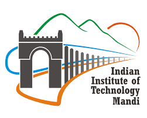

<h1 align="center">Summer Internship 2025 – Computer Vision in Underwater Autonoumous Vehicles</h1>

  <b>Institution:</b> Indian Institute of Technology Mandi 
  <b>Intern:</b> G Wilfred Auxilian 
  <b>Project Duration:</b> June–August 2025

<b>Kindly check the problem statement files for more info and you can contact me if you have doubts or queries</b>

## 📂 Dataset: Dam Cracks (Summer Internship 2025)
This dataset is hosted privately on [Kaggle](https://www.kaggle.com/datasets/gwilfredauxilian/summer-internship-2025-dam-cracks-dataset) and is not publicly accessible.
> ⚠️ Access is restricted to collaborators. If you need access, please contact the dataset owner.
